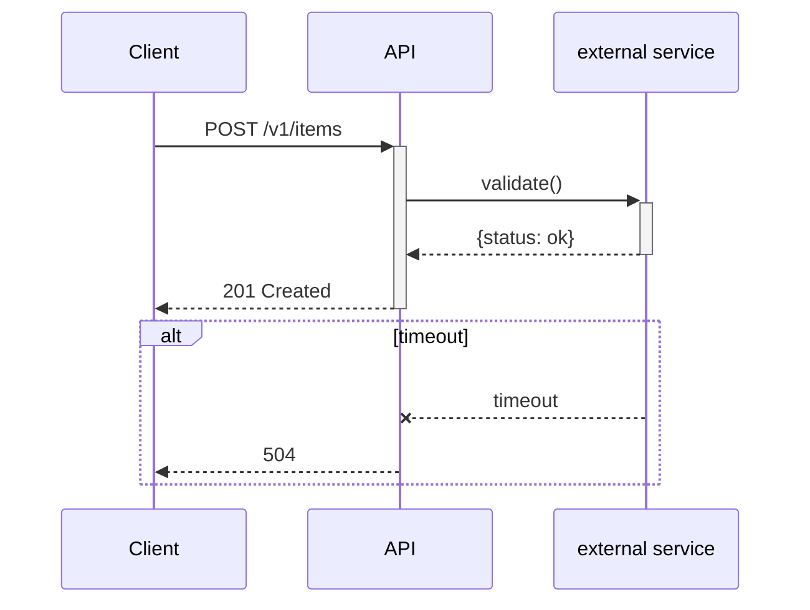
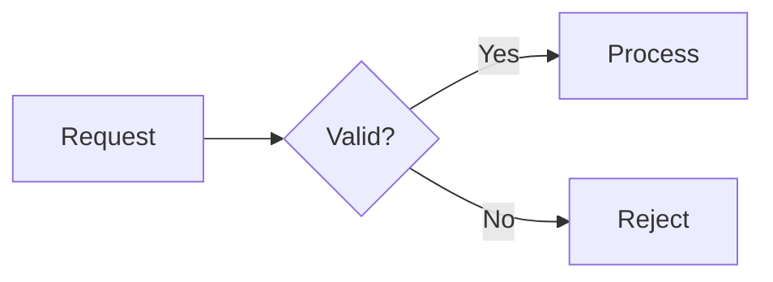
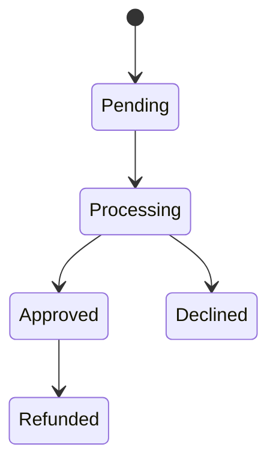
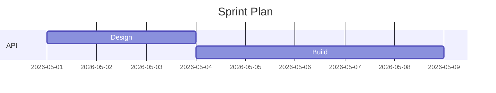
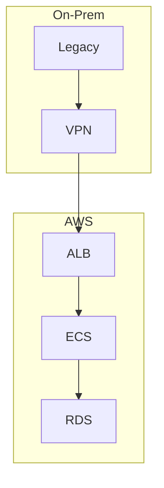

# Mermaid Diagram Syntax

## Sequence Diagram


## ER Diagram
```mermaid
erDiagram
    CUSTOMER ||--o{ SHIPMENT : creates
    CUSTOMER { string id PK; string name }
    SHIPMENT { string id PK; int quantity }
```

## Flowchart


## State Diagram


## Gantt Chart


## Deployment Diagram

