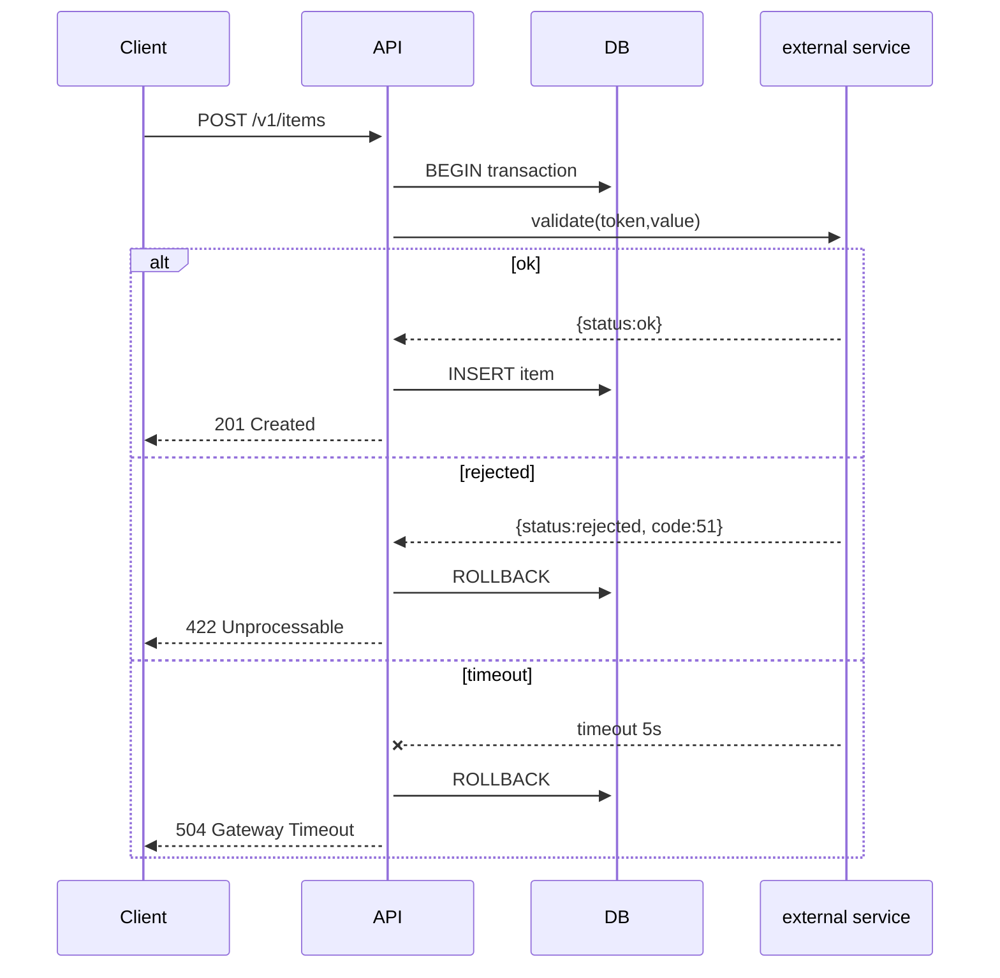
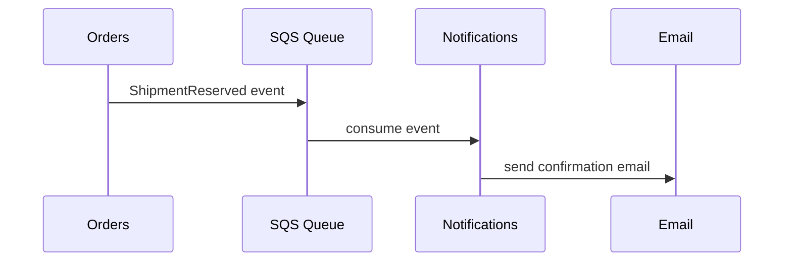

# Sequence Diagram Patterns

## API Flow with Error Handling

## Async Event Flow

## Key Rules
- ALWAYS include error paths (alt/else)
- Participants: use descriptive names
- Notes for important context
- NEVER omit failure modes
