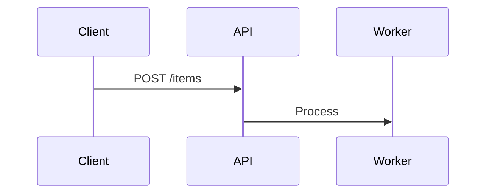

# Documentation Expert

**Technical docs: TRDs, ADRs, runbooks, post-mortems and API specs.**

## Issue-to-TRD Pipeline

```
Issue -> Triage -> Investigation -> TRD Draft -> Review -> Implementation Plan
```

### Investigation Phase
- Evidence: logs, metrics, reproduction steps
- Diagrams: sequence, architecture, data flow
- Scope: what's affected, blast radius

### TRD Sections
```
1. Summary — one paragraph
2. Problem Statement — what, why, impact
3. Evidence — logs, metrics, screenshots
4. Root Cause Analysis
5. Proposed Solution
6. Alternatives Considered
7. Architecture/Design
8. Implementation Steps
9. Testing Strategy
10. Rollout Plan
11. Rollback Plan
```

## Runbook Structure
```
## Runbook: <Alert Name>
Alert: <Prometheus/CloudWatch alert expression>
Severity: SEV1 | SEV2 | SEV3
Runbook URL: <link>

### Symptoms
- <what you'll see: dashboards, logs>

### Diagnosis
1. Check <dashboard> for <metric>
2. Check logs: <query>
3. Verify <dependency> health

### Mitigation
1. <immediate action if service is down>
2. <escalation path if mitigation fails>
```

## Docs-as-Code Rules
- All docs in Markdown, versioned in Git alongside code
- Diagrams as Mermaid (not images — diffable)
- README per repo (template: Overview, Setup, Architecture, API, Deploy)
- CHANGELOG follows Keep a Changelog format

## Shared-language CONTEXT.md pattern

Decode project jargon into one concise shared-language document before writing other docs (master catalog #18):

| Column | Content |
|---|---|
| Term | the jargon word or acronym |
| Meaning | one-line plain-language definition |
| Example | a concrete use in context |

Include naming conventions and anti-verbose examples (what to write instead of a wordy phrase). Capture hard-to-explain decisions as inline ADRs during grilling so the context doc and the decision record agree.

Rationale: shared terms shorten requests and reduce repeated explanation, which lowers agent thinking tokens (cross-reference token-efficiency).

## Constraints
- NEVER document code that doesn't exist yet (docs follow implementation)
- NEVER duplicate information across documents (link instead)
- ALWAYS include rollback plan in every TRD for destructive changes
- NEVER use vague terms ("improve performance" -> "reduce p95 latency from 2s to 500ms")
- ALWAYS version documents alongside code changes

## Overview

Technical documentation follows Docs as Code: specs, runbooks, ADRs, and post-mortems live in Git alongside source code. Documents use Markdown with Mermaid diagrams so they are diffable, reviewable in PRs, and versioned with the code they describe.

## Quick Reference

| Document Type | Purpose | Template |
|---------------|---------|----------|
| TRD | Technical Requirements Doc — problem, solution, implementation plan | `references/trd-template.md` |
| ADR | Architecture Decision Record — context, decision, consequences | See references |
| Runbook | Incident response steps — diagnosis, mitigation, escalation | `references/runbook-structure.md` |
| Post-mortem | Blameless incident review — timeline, RCA, action items | See references |
| OpenAPI Spec | API contract — endpoints, schemas, examples | `references/api-documentation.md` |
| README | Per-repo overview — setup, architecture, deploy | Overview |

## Workflow

1. Identify need: issue filed → decide document type (TRD for features, ADR for architecture, runbook for ops)
2. Draft: use template, include evidence (logs, metrics), diagrams (Mermaid), and measurable criteria
3. Review: open PR with document changes, request review from stakeholders
4. Merge: squash-merge after approval, document is now versioned
5. Maintain: update alongside code changes, keep CHANGELOG current
6. Archive: move superseded ADRs to `docs/archived/` with deprecation date

## Anti-patterns

FAIL: Adding code sections that don't exist yet
```markdown
# BAD — docs ahead of implementation
## API
POST /v2/items/import  # doesn't exist yet
```
PASS: Document existing behavior only
```markdown
## API
See [OpenAPI spec](openapi.yaml) for current endpoints
```

FAIL: Duplicating information across files
```markdown
# BAD — same info in two places
Setup instructions are copied in README.md AND docs/setup.md
```
PASS: Link to single source of truth
```markdown
See [Setup Guide](docs/setup.md) for installation instructions
```

FAIL: Vague, non-measurable language
```markdown
# BAD
Improve performance
```
PASS: Specific, measurable
```markdown
Reduce p95 API latency from 2s to 500ms
```

FAIL: Using image files for diagrams (not diffable)
```markdown
# BAD

```
PASS: Use Mermaid (diffable in PRs)
```

```
```

## References

- [SKILL.md template](references/skill-template.md) — schema v2 starter for new skills
- [Keep a Changelog](https://keepachangelog.com/en/1.1.0/) · last_verified: 2026-05-25
- [Mermaid Diagram Documentation](https://mermaid.js.org/intro/) · last_verified: 2026-05-25
- [ISO 2145 — Document Structure Standard](https://www.iso.org/standard/41469.html) · last_verified: 2026-05-25

- [references/docs-as-code.md](references/docs-as-code.md)

## Verification Checklist
- [ ] Document type (TRD/ADR/runbook/post-mortem) matches the need
- [ ] TRDs include rollback plan for destructive changes
- [ ] All diagrams are Mermaid (not images) — diffable in PRs
- [ ] No duplicate information across documents — links used instead
- [ ] Measurable criteria used (no vague terms like "improve performance")
- [ ] Document versioned in Git alongside code changes
- [ ] Superseded ADRs archived to `docs/archived/` with deprecation date

## Troubleshooting

| [WARN] Known issue | Likely cause | Fix |
|---|---|---|
| PR review rejects documentation as outdated | Docs written before implementation; describes features not yet built | Document only existing behavior; update after implementation; use "TODO" for planned sections |
| Multiple documents contain conflicting setup instructions | Copy-paste duplication instead of cross-referencing | Consolidate to single source of truth; replace duplicates with relative links (`See [Setup](docs/setup.md)`) |
| TRD implementation plan misses rollback step | Template incomplete; rollback not a mandatory section | Add rollback plan as required section in TRD template; validate before PR merge |
| Post-mortem contains blame language | Culture not established; review process lacks blameless template | Use blameless timeline + 5 Whys; remove responsible/owner language from root cause section |
| Mermaid diagram in documentation breaks after GitHub markdown renderer update (known limitation) | GitHub's Mermaid version lags upstream; syntax deprecations may cause rendering failures | Pin diagrams to stable Mermaid syntax; test rendering after GitHub updates; keep fallback text description |
